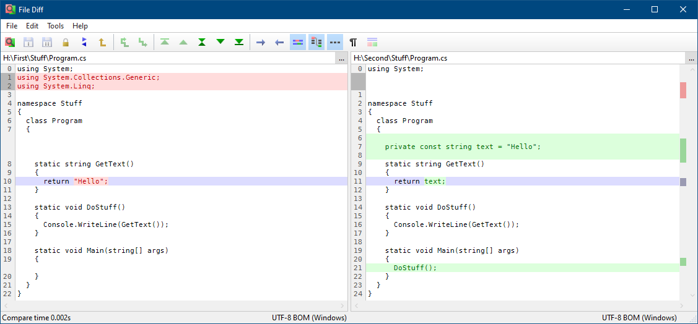
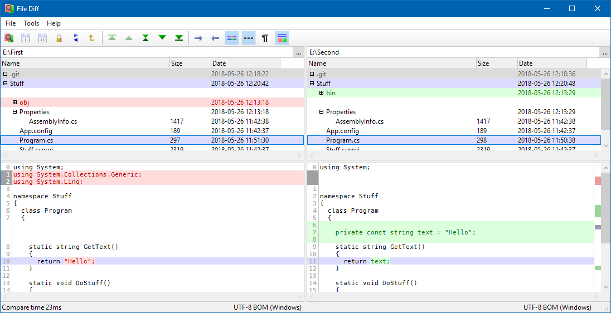
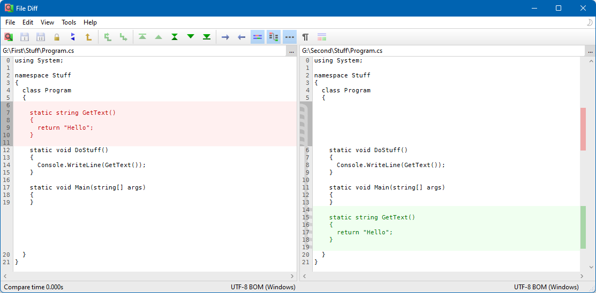
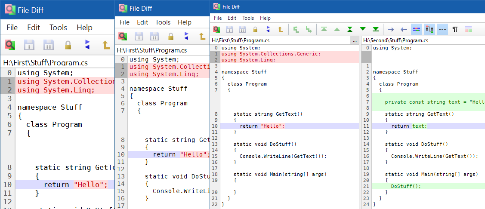

File Diff
=========

A visual file and directory diff tool.

### Download
Download latest version **[HERE](https://jonashertzman.github.io/FileDiff/download/FileDiff.zip)**

### Features
- File compare
- Inline diffs
- Detects moved file sections
- Multi level directory compare
- Combined master detail compare
- Editable diffs
- High DPI support

### Screen shots

*File compare.*

*Directory compare.*

*Combined master detail compare for quickly going through multiple diffs in large file trees.* 

*Moved file section.*

*Full DPI support.*
